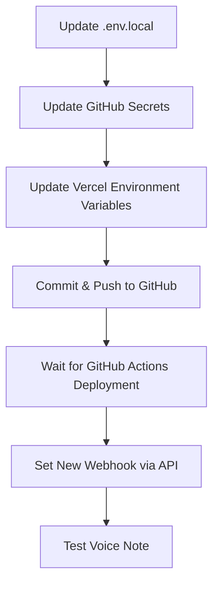

# 🤖 Telegram Bot Migration Guide

> **Complete guide to switch the voice notes bot to a different device or create a new bot**

---

## 📋 Overview

This guide covers how to:
1. **Move existing bot** from personal phone to work phone
2. **Create a completely new bot** for work phone
3. **Update all deployment configurations** (GitHub, Vercel)
4. **Test the new setup**

---

## 🎯 Option 1: Move Existing Bot to New Device

### Step 1: Install Telegram on Work Phone
1. Download and install Telegram on the work phone
2. Log in with **the same phone number** that created the original bot
3. All bots will automatically be available

### Step 2: Verify Bot Access
1. Open Telegram on work phone
2. Search for **@BotFather**
3. Send `/mybots` command
4. You should see your existing bot listed
5. Click on your bot → **API Token** to verify it's the same token

### Step 3: No Code Changes Needed
- Keep the same `TELEGRAM_BOT_TOKEN` 
- No environment variable updates required
- Bot will work from new device automatically

---

## 🆕 Option 2: Create New Bot for Work Phone

### Step 1: Create New Bot
1. **Install Telegram** on work phone with work phone number
2. **Search for @BotFather**
3. **Send `/newbot` command**
4. **Choose bot name**: "Ottica Bianchi Voice Bot" (or similar)
5. **Choose username**: something like `ottica_bianchi_voice_bot` (must end with `_bot`)
6. **Copy the new bot token** (looks like: `1234567890:ABCdefGHIjklMNOpqrSTUvwxyz`)

### Step 2: Update Environment Variables

#### A. Update Local Development (.env.local)
```env
# OLD
TELEGRAM_BOT_TOKEN=8133766988:AAGma9_ybQ_tcPdkdNKd0h7dMIbH8Qg44xI

# NEW (replace with your new token)
TELEGRAM_BOT_TOKEN=YOUR_NEW_BOT_TOKEN_HERE
```

#### B. Update GitHub Secrets
1. **Go to**: https://github.com/OtticaBianchi/gestionale/settings/secrets/actions
2. **Find**: `TELEGRAM_BOT_TOKEN`
3. **Click**: Update
4. **Paste**: Your new bot token
5. **Save**

#### C. Update Vercel Environment Variables
1. **Go to**: https://vercel.com/dashboard
2. **Find your project**: ob-gestionale-2025
3. **Go to**: Settings → Environment Variables
4. **Find**: `TELEGRAM_BOT_TOKEN`
5. **Edit**: Replace with new token
6. **Save**

### Step 3: Deploy Changes
```bash
# Trigger new deployment to update bot token
git commit --allow-empty -m "Switch to new Telegram bot token"
git push
```

### Step 4: Set New Webhook
Wait for deployment to complete (2-3 minutes), then:
```bash
# Set webhook for new bot (replace TOKEN with your new token)
curl -X POST "https://api.telegram.org/botYOUR_NEW_TOKEN/setWebhook" \
  -H "Content-Type: application/json" \
  -d '{"url":"https://ob-gestionale-2025.vercel.app/api/telegram/webhook","drop_pending_updates":true}'
```

---

## 🔧 Step-by-Step Deployment Update Process

### 1. Environment Variables to Update

| Location | Variable | Value |
|----------|----------|-------|
| `.env.local` | `TELEGRAM_BOT_TOKEN` | New bot token |
| GitHub Secrets | `TELEGRAM_BOT_TOKEN` | New bot token |
| Vercel Dashboard | `TELEGRAM_BOT_TOKEN` | New bot token |

### 2. Deployment Order


### 3. Commands Checklist
```bash
# 1. Update environment variables (manual step in dashboards)

# 2. Deploy changes
git add .env.local  # Only if you want to commit local changes
git commit -m "Update Telegram bot configuration"
git push

# 3. Wait for deployment (check GitHub Actions tab)

# 4. Set webhook (replace with your token)
curl -X POST "https://api.telegram.org/botYOUR_NEW_TOKEN/setWebhook" \
  -H "Content-Type: application/json" \
  -d '{"url":"https://ob-gestionale-2025.vercel.app/api/telegram/webhook","drop_pending_updates":true}'

# 5. Verify webhook
curl -X GET "https://api.telegram.org/botYOUR_NEW_TOKEN/getWebhookInfo"
```

---

## 🧪 Testing the New Bot

### Step 1: Verify Bot Response
1. **Find your new bot** in Telegram (search by username)
2. **Send `/start` command**
3. **Expected response**: Bot should respond with welcome message

### Step 2: Test Voice Note
1. **Send a voice message** to the bot
2. **Check**: https://ob-gestionale-2025.vercel.app/dashboard/voice-notes
3. **Expected**: Voice note should appear within 30 seconds

### Step 3: Troubleshooting
If voice notes don't appear:

```bash
# Check webhook status
curl -X GET "https://api.telegram.org/botYOUR_NEW_TOKEN/getWebhookInfo"

# Should show:
# - url: "https://ob-gestionale-2025.vercel.app/api/telegram/webhook"
# - pending_update_count: 0 (or low number)
# - No last_error_message
```

---

## 🚨 Important Notes

### Security
- **Never share bot tokens** publicly
- **Delete old bot tokens** if creating new bot
- **Keep tokens in environment variables only**

### Bot Limits
- **One bot per phone number** when creating new bots
- **Existing bots work from multiple devices** with same account
- **Bot usernames must be unique** across all Telegram

### Deployment
- **Always update all three locations**: local, GitHub, Vercel
- **GitHub Actions deployment takes 2-3 minutes**
- **Webhook must be set AFTER deployment completes**

---

## 📞 Quick Reference Commands

```bash
# Create new bot via BotFather
/newbot

# Check webhook status
curl -X GET "https://api.telegram.org/botTOKEN/getWebhookInfo"

# Set webhook
curl -X POST "https://api.telegram.org/botTOKEN/setWebhook" \
  -H "Content-Type: application/json" \
  -d '{"url":"https://ob-gestionale-2025.vercel.app/api/telegram/webhook"}'

# Delete webhook (if needed)
curl -X POST "https://api.telegram.org/botTOKEN/deleteWebhook"

# Test bot
curl -X POST "https://api.telegram.org/botTOKEN/sendMessage" \
  -H "Content-Type: application/json" \
  -d '{"chat_id":"YOUR_CHAT_ID","text":"Test message"}'
```

---

## 🎯 Recommended Approach

**For work setup, I recommend Option 2 (New Bot)**:
- ✅ Clean separation between personal/work
- ✅ Work phone controls work bot
- ✅ Easier to manage permissions
- ✅ Can customize bot name/avatar for work

---

*Last Updated: September 9, 2025*
*Version: Vercel Deployment Compatible*